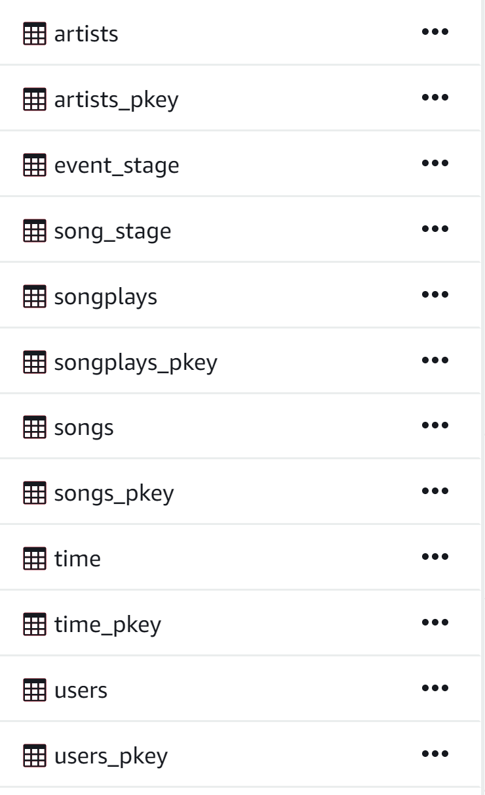
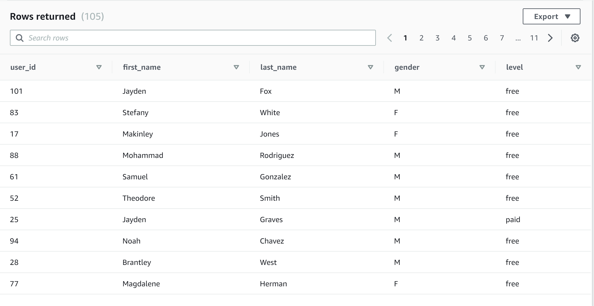

## Concept
In this project, I have applied what I've learned on data warehouses and AWS to build an ETL pipeline for a database hosted on Redshift. To complete the project, I will load data from S3 to staging tables on Redshift and execute SQL statements that create the analytics tables from these staging tables.

I am writing this with the assumption that the reader already has an Amazon Web Services account and knows how to navigate to the different services within their account. I will be providing links that help with the setup proccess. If you dont know how to setup an account [here is a great resource](https://aws.amazon.com/premiumsupport/knowledge-center/create-and-activate-aws-account/).

## Content
- The Data
- Redshift and IAM Setup
- dwh.cfg
- Creating Tables
- Building the ETL pipeline
- Quality Check
- Run

## The Data
I Will be working with datasets that reside in S3. Here is a good resource on [how to set up data](https://docs.aws.amazon.com/quickstarts/latest/s3backup/step-1-create-bucket.html) in S3. 

The first dataset is a subset of real data from the Million Song Dataset. Each file is in JSON format and contains metadata about a song and the artist of that song. The files are partitioned by the first three letters of each song's track ID. For example, here are filepaths to two files in this dataset.

        song_data/A/B/C/TRABCEI128F424C983.json
        song_data/A/A/B/TRAABJL12903CDCF1A.json
        
And below is an example of what a single song file, TRAABJL12903CDCF1A.json, looks like.

        {"num_songs": 1, "artist_id": "ARJIE2Y1187B994AB7", "artist_latitude": null, "artist_longitude": null, "artist_location": "", "artist_name": "Line Renaud", "song_id": "SOUPIRU12A6D4FA1E1", "title": "Der Kleine Dompfaff", "duration": 152.92036, "year": 0}
        
The second dataset consists of log files in JSON format generated by an event simulator based on the songs in the dataset above. These simulate activity logs from a music streaming app based on specified configurations.

The log files in the dataset I'll be working with are partitioned by year and month. For example, here are filepaths to two files in this dataset.

        log_data/2018/11/2018-11-12-events.json
        log_data/2018/11/2018-11-13-events.json

## Redshift Cluster and IAM Setup
The first step in setting up this enviroment for Amazon Web Services is to creat an IAM [User](https://docs.aws.amazon.com/IAM/latest/UserGuide/id_users_create.html), [Security Group](https://docs.aws.amazon.com/vpc/latest/userguide/VPC_SecurityGroups.html) and [Role](https://docs.aws.amazon.com/AWSEC2/latest/UserGuide/iam-roles-for-amazon-ec2.html).

I have setup The IAM Role in the following ways:
        
        AWS Service Group: Redshift
        Use Case: Redshift-Customizable
        Permissions: AmazonS3ReadOnlyAccess
        Role Name: myRedshiftRole
        
My Security group has been made with the following properties:
        
        Security Group Name: redshift_security_group
        Description: "Authorize Redshift cluster"
        Security Group Rules:
            Type: Custom TCP Rule
            Protocol: TCP
            Port Range: 5439
            Custom IP: 0.0.0.0/0 (Only for Demo Purposes)
            
Finally, The I am user has been setup in the following way:

        Name: airflow_redshift_user
        Access Type: Programmatic Acess
        Add the following policies:
            AmazonRedshiftFullAccess
            AmazonS3ReadOnlyAccess
            
Creating this process will return a .csv file with a Secret Key and user ID. You will need to safegaurd these credentials and not share them with anyone. 

We will complete the last step of our setup by launching a Redshift cluster. Here is a link with information on [how to launch a cluster](https://docs.aws.amazon.com/ses/latest/DeveloperGuide/event-publishing-redshift-cluster.html). WARNING: The cluster that you are about to launch will be live, and you will be charged the standard Amazon Redshift usage fees for the cluster until you delete it. Make sure to delete your cluster each time you're finished working to avoid large, unexpected costs for yourself.

        Cluster identifier: Enter redshift-cluster.
        Database name: Enter dev.
        Database port: Enter 5439.
        Master user name: Enter awsuser.
        Master user password and Confirm password: Enter a password for the master user account.
        Node type: dc2.large
        (accept defaults for node configuration)
        VPC Security Groups: redshift_security_group
        Available IAM Roles: myRedshiftRole
        
it will take a couple minutes for the cluster to be ready. just wait unitl it says available and you are ready to go. 

## dwh.cfg
In order to successfully run the program we need to configure it with the credintials we get from our account. 

These credentials are not included in this repository for security purposes.

## Creating Tables (Sql_queries.py)
We first want to make sure that we have access to our config file to set implement certain perameters.

        import configparser

        # CONFIG
        config = configparser.ConfigParser()
        config.read('dwh.cfg')

secondly, we need to setup queries to drop tables so that each time we are developing we drop the table to prevent repeat data.

The first difference in querying tables with redshift is to create staging tables. So we create the two tables 'event_stage' and 'song_stage'. 

        staging_songs_table_create= ("""CREATE TABLE IF NOT EXISTS song_stage \
                                    (num_songs int, \
                                    artist_id varchar, \
                                    artist_latitude varchar, \
                                    artist_longitude varchar, \
                                    artist_location varchar, \
                                    artist_name varchar, \
                                    song_name varchar, \
                                    song_id varchar, \
                                    title varchar, \
                                    duration float, \
                                    year int)
        """)

        staging_events_table_create = ("""CREATE TABLE IF NOT EXISTS event_stage \
                                        (artist_name varchar, \
                                        auth varchar, \
                                        first_name varchar, \
                                        gender varchar, \
                                        item_in_session int, \
                                        last_name varchar, \
                                        length float, \
                                        level varchar, \
                                        location varchar, \
                                        method varchar, \
                                        page varchar, \
                                        registration float, \
                                        session_id int, \
                                        song varchar, \
                                        status int, \
                                        ts varchar, \
                                        user_agent varchar, \
                                        user_id int);
        """)
        
I order to get data for the staging tables which will provide the essential data for the rest of our tables we need to COPY the data from our S3 bucket to the staging tables. 

        staging_songs_copy = ("""
            COPY song_stage FROM 's3://udacity-dend/song_data'
            CREDENTIALS 'aws_iam_role={}'
            FORMAT AS JSON 'auto' REGION 'us-west-2'
        """).format(*config['IAM_ROLE'].values())
        
Another difference in setting querying through the cluster is the way that we insert data from the staging tables to our data tables. The way we do this is by selecting direclty from the staging tables. 

        artist_table_insert = ("""
            INSERT INTO artists (
            artist_id,
            name,
            location,
            latitude,
            longitude
            )
            SELECT DISTINCT s.artist_id as artist_id,
                s.artist_name as name,
                s.artist_location as location,
                s.artist_latitude as latitude,
                s.artist_longitude as longitude
            FROM song_stage s
        """)
        

## Building the ETL Pipeline        
In both create_tables.py and etl.py we use our configParser to get our credentials to successfully connect to the redshift cluster and call our fuctions that use the created queries in sql_queries.py to Drop, Create, Load data, and insert data into our tables.

## Quality Check
After running create_tables.py and etl.py our data is finally in our cluster and can be accessed from there. from the query editor we can see that all tables have been created. 

from here we can query the database with a simple query such as just to see that data has been entered in the database:

        Select * From users
        
we get:

## Run
I am running this program on a jupyter lab and should work with all versions (currently May 2020).

In order to successfully run the program You must have all files downloaded.

- Create AWS Account
- Follow setup proccess above with correct parameters
- Run Create_tables.py (Drops and creates required tables)
- Run Etl.py (Processes data and pipes to database, may take time to complete)
- Wait for "Complete" print statements with each process (If error has not occured then proccess is still running)
